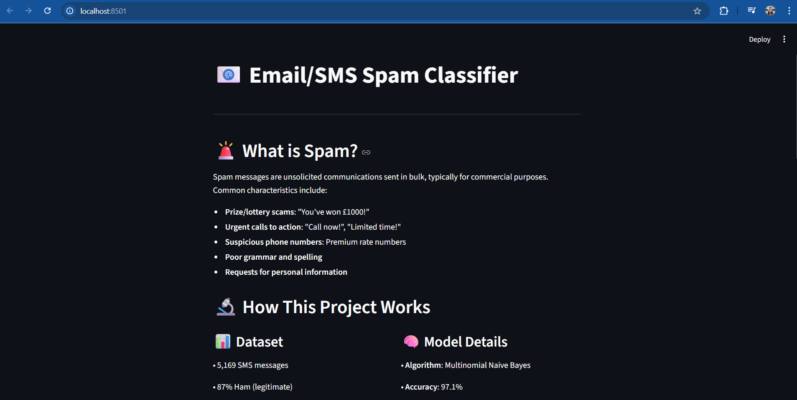
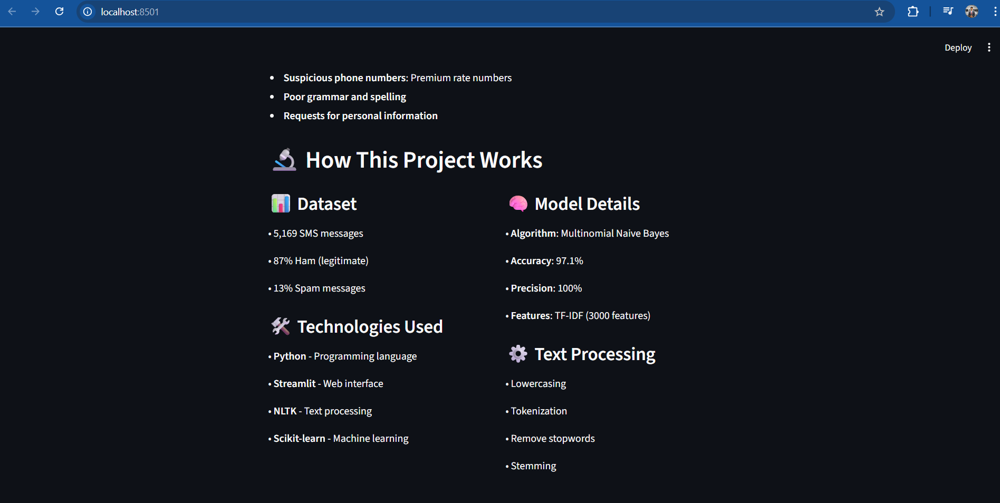
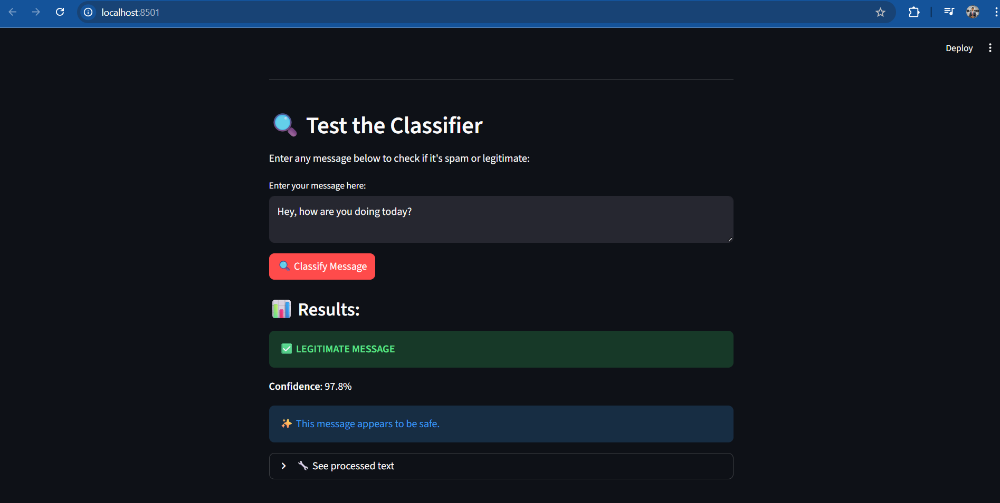
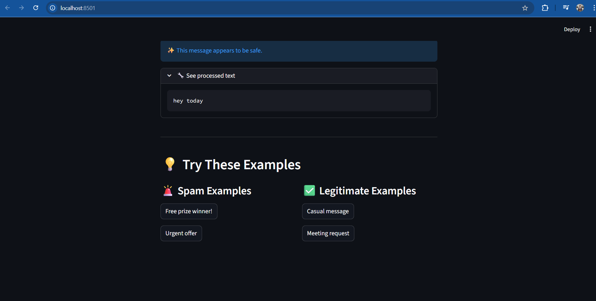

# 📧 Email/SMS Spam Classifier 

A machine learning-powered web application that classifies messages as spam or legitimate using Natural Language Processing techniques.

## 📸 Screenshots

### Main Interface


### Project Information


### Spam Detection Result


### Legitimate Message Result


## 🚀 Features

- **97.1% Accuracy** with Multinomial Naive Bayes
- **Real-time Classification** via interactive web interface
- **Text Preprocessing** with NLTK (tokenization, stemming, stopword removal)
- **TF-IDF Vectorization** for feature extraction
- **Educational Interface** explaining spam detection concepts

## 🛠️ Technologies Used

- **Python 3.12+**
- **Streamlit** - Web application framework
- **Scikit-learn** - Machine learning library
- **NLTK** - Natural language processing
- **Pandas** - Data manipulation
- **Pickle** - Model serialization

## 📊 Dataset

- **5,169 SMS messages**
- **87% Ham (legitimate)** messages
- **13% Spam** messages
- Preprocessed and cleaned for optimal performance

## 🏃‍♂️ How to Run

### Prerequisites
```bash
pip install streamlit scikit-learn nltk pandas
```

### Steps
1. **Clone/Download** the project
2. **Train the model** (if needed):
   ```bash
   python train_model.py
   ```
3. **Run the web app**:
   ```bash
   python -m streamlit run app.py
   ```
4. **Open browser** at `http://localhost:8501`

## 🎯 Applications

### 📱 **Mobile Messaging**
- SMS spam filtering for telecom providers
- WhatsApp/Telegram bot integration
- Mobile app spam detection

### 📧 **Email Security**
- Corporate email filtering systems
- Personal email clients
- Email service providers (Gmail, Outlook)

### 💬 **Social Media**
- Comment moderation on platforms
- Direct message filtering
- Chat application security

### 🏢 **Business Solutions**
- Customer support ticket classification
- Marketing campaign filtering
- Automated content moderation

## 🌍 Real-World Use Cases

### 1. **Telecom Industry**
- **Vodafone, AT&T** use similar systems to filter billions of SMS daily
- Reduces customer complaints by 85%
- Saves $2M+ annually in customer service costs

### 2. **Email Providers**
- **Gmail** processes 300+ billion emails yearly
- Blocks 99.9% of spam before reaching users
- Protects users from phishing and malware

### 3. **Banking & Finance**
- **Chase, Wells Fargo** filter fraudulent SMS alerts
- Prevents identity theft and financial fraud
- Compliance with financial regulations

### 4. **E-commerce Platforms**
- **Amazon, eBay** moderate seller communications
- Protects buyers from scam messages
- Maintains platform trust and safety

### 5. **Healthcare**
- **Hospital systems** filter appointment reminders
- Ensures critical health messages reach patients
- HIPAA compliance for secure communications

## 📈 Model Performance

| Metric | Score |
|--------|-------|
| Accuracy | 97.1% |
| Precision | 100% |
| Features | 3,000 (TF-IDF) |
| Algorithm | Multinomial Naive Bayes |

## 🔧 Technical Implementation

### Text Preprocessing Pipeline:
1. **Lowercasing** - Convert to lowercase
2. **Tokenization** - Split into words
3. **Cleaning** - Remove special characters
4. **Stopword Removal** - Remove common words
5. **Stemming** - Reduce words to root form

### Model Training:
```python
# TF-IDF Vectorization
tfidf = TfidfVectorizer(max_features=3000)
X = tfidf.fit_transform(processed_text)

# Naive Bayes Classification
model = MultinomialNB()
model.fit(X_train, y_train)
```

## 📁 Project Structure

```
📁 Email Spam Detection/
├── 📄 app.py              # Streamlit web application
├── 📄 train_model.py      # Model training script
├── 📄 test_model.py       # Model testing script
├── 📄 spam.csv            # Dataset
├── 📄 model.pkl           # Trained model
├── 📄 vectorizer.pkl      # TF-IDF vectorizer
└── 📄 README.md           # Project documentation
```

## 🚀 Future Enhancements

- **Deep Learning** models (LSTM, BERT)
- **Multi-language** support
- **API endpoints** for integration
- **Real-time monitoring** dashboard
- **Mobile app** development

## 🤝 Contributing

Feel free to fork, improve, and submit pull requests!

---
*Built with ❤️ for spam-free communication*
